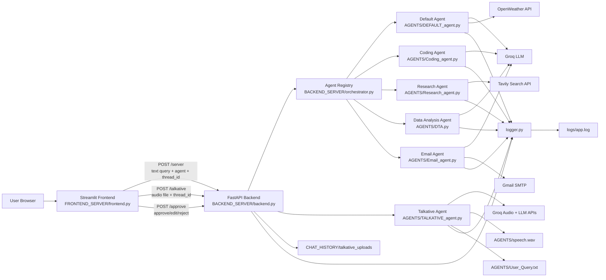
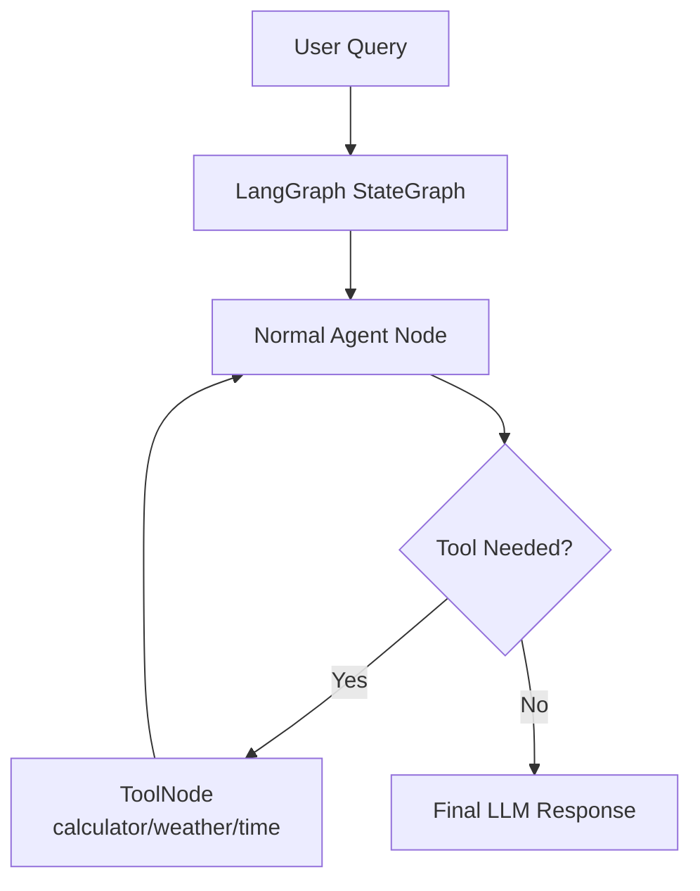
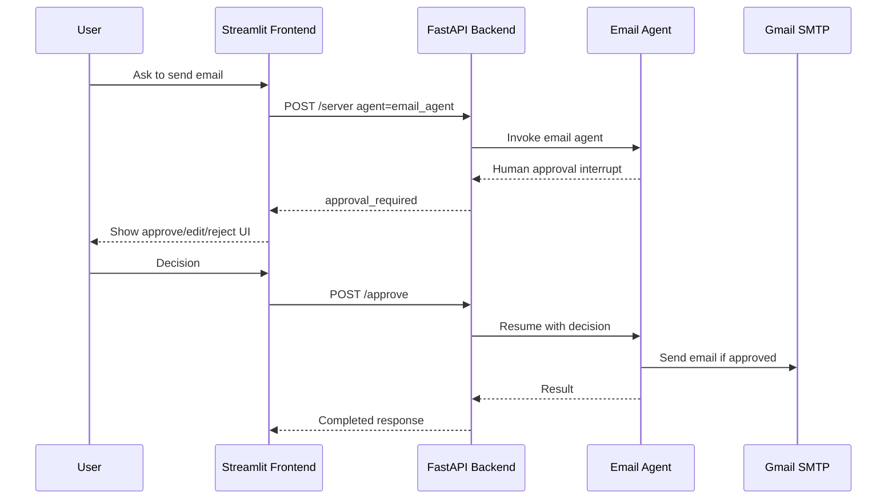
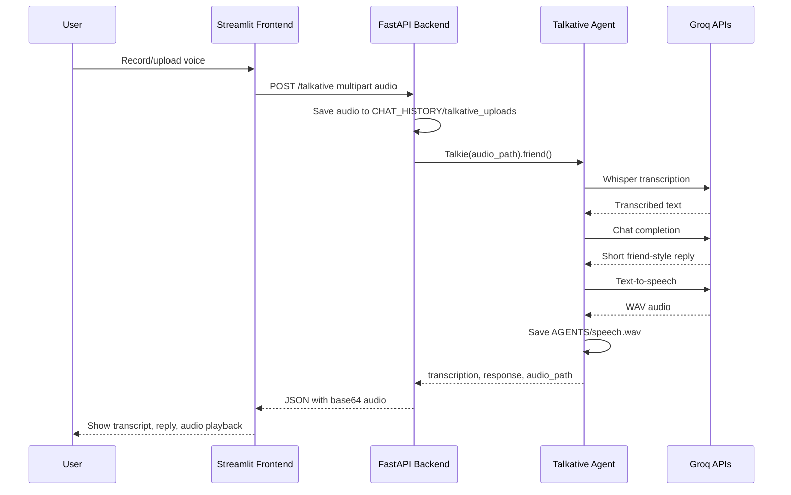
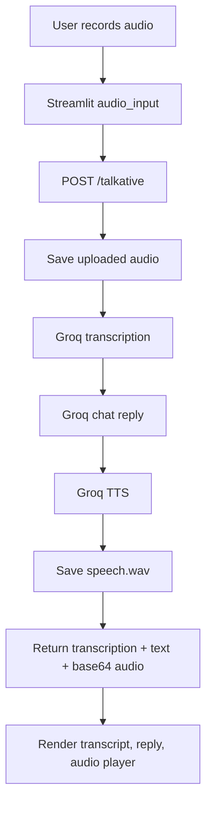

# AI Employee OS - System Architecture

## High-Level Architecture



## Runtime Layers

### 1. Frontend Layer

File: `FRONTEND_SERVER/frontend.py`

The frontend is a Streamlit app that provides a GPT-style chat experience. It lets the user:

- Select an agent from the sidebar.
- Send text prompts to normal agents.
- Record/upload audio for the Talkative voice agent.
- Review and approve/reject email actions when human approval is required.
- View conversation history and transcript details.

Main outbound calls:

- `POST /server` for normal, interactive, and two-input agents.
- `POST /talkative` for voice/audio interaction.
- `POST /approve` for email-agent human approval decisions.

### 2. API Layer

File: `BACKEND_SERVER/backend.py`

The backend is a FastAPI server. It receives frontend requests, validates request bodies with Pydantic models, routes work to the correct agent, and returns normalized responses to the frontend.

Endpoints:

- `/server`: Handles text-based agent requests.
- `/talkative`: Handles uploaded audio, calls the Talkative agent, and returns transcription, text response, and base64 WAV audio.
- `/approve`: Resumes the email agent after a human approval/edit/reject decision.

### 3. Orchestration Layer

File: `BACKEND_SERVER/orchestrator.py`

The orchestrator maps frontend agent keys to Python callables.

Agent types:

- `normal`: Called as `selected_agent(query)`.
- `interactive`: LangGraph/LangChain agent invoked with thread state and approval support.
- `two_info`: Called as `selected_agent(df_info, query)`.

Registered agents:

- `default_agent`
- `code_debugger`
- `code_explainer`
- `code_reviewer`
- `dta_bot`
- `websearch_agent`
- `deepsearch_agent`
- `question_&_answer_agent`
- `email_agent`

Note: `talkative_agent` is currently routed directly by `/talkative` in `backend.py`, not through `orchestrator.py`, because it uses multipart audio upload instead of the normal JSON `/server` request.

## Agent Architecture

### Default Agent

File: `AGENTS/DEFAULT_agent.py`

Uses LangGraph with:

- `StateGraph`
- `MemorySaver`
- ToolNode
- Groq chat model

Tools:

- Calculator
- Weather lookup through OpenWeather
- Current system time

Flow:



### Coding Agent

File: `AGENTS/Coding_agent.py`

Uses Groq through `ChatGroq` with specialized prompt wrappers:

- Debugging
- Code explanation
- Code review

Each method builds a role-specific prompt, invokes the model, and returns `response.content`.

### Research Agent

File: `AGENTS/Research_agent.py`

Uses Tavily for search-backed responses:

- Basic web search
- Advanced deep search
- Q&A search

This agent is used for live/current information that may not exist in the LLM context.

### DTA Bot

File: `AGENTS/DTA.py`

Uses Groq to analyze dataset information plus a user query.

Input shape:

- `df_info`
- `query`

Output:

- Trends
- Anomalies
- Risks
- Business insights
- Suggested next actions

### Email Agent

File: `AGENTS/Email_agent.py`

Uses:

- Groq model
- LangChain `create_agent`
- `HumanInTheLoopMiddleware`
- Gmail SMTP
- Structured email generation with a Pydantic schema

The email tool is protected by human approval.

Flow:



### Talkative Agent

File: `AGENTS/TALKATIVE_agent.py`

Uses Groq audio and chat APIs to support voice conversation.

Flow:



## Data and State

### Session State

Managed by Streamlit:

- `thread_id`
- `chat_history`
- `pending_interrupt`
- `selected_agent`

### Persistent Files

- `logs/app.log`: Central application log.
- `CHAT_HISTORY/talkative_uploads`: Uploaded audio files for Talkative requests.
- `AGENTS/speech.wav`: Latest generated Talkative speech output.
- `AGENTS/User_Query.txt`: Latest Talkative transcription.

### Environment Variables

Required by agents:

- `GROQ_API_KEY`
- `TAVILY_API_KEY`
- `APP_PASSWORD`
- `weather_api_key`

## Main Request Flows

### Text Agent Flow

```mermaid
flowchart TD
    A[User enters message] --> B[Streamlit frontend]
    B --> C[POST /server]
    C --> D[FastAPI backend]
    D --> E[Read AGENTS and AGENT_TYPES]
    E --> F{Agent Type}
    F -->|normal| G[Call selected_agent(query)]
    F -->|interactive| H[Invoke LangGraph/LangChain agent]
    F -->|two_info| I[Call selected_agent(df_info, query)]
    G --> J[Return completed response]
    H --> K{Approval required?}
    K -->|Yes| L[Return approval_required]
    K -->|No| J
    I --> J
    J --> M[Render GPT-style chat response]
```

### Voice Agent Flow



## Deployment Shape

Local development currently runs as two processes:

```text
Streamlit frontend: http://127.0.0.1:8501
FastAPI backend:    http://127.0.0.1:8000
```

Typical commands:

```powershell
.\.venv\Scripts\python.exe -m uvicorn BACKEND_SERVER.backend:app --host 127.0.0.1 --port 8000
.\.venv\Scripts\python.exe -m streamlit run FRONTEND_SERVER/frontend.py --server.port 8501 --server.address 127.0.0.1
```

## Current Architecture Notes

- The app is already modular: frontend, backend, orchestrator, and agents are separated.
- Most text agents are registered through `orchestrator.py`.
- Talkative is separate because it requires multipart file upload and returns binary audio encoded as base64.
- Email is the only human-in-the-loop workflow right now.
- Streamlit stores chat state in memory, so chat history is session-local.
- LangGraph memory is used in the Default agent and Email agent, but not all agents share a common memory layer yet.

## Suggested Next Improvements

- Register `talkative_agent` metadata in the orchestrator even if routing remains separate.
- Add a unified response schema for all agents.
- Add persistent conversation storage under `CHAT_HISTORY`.
- Avoid shared `AGENTS/speech.wav` for concurrent users by writing per-request output files.
- Add WebSocket/WebRTC if true real-time voice streaming is required.
- Add authentication before exposing email sending or file upload publicly.
